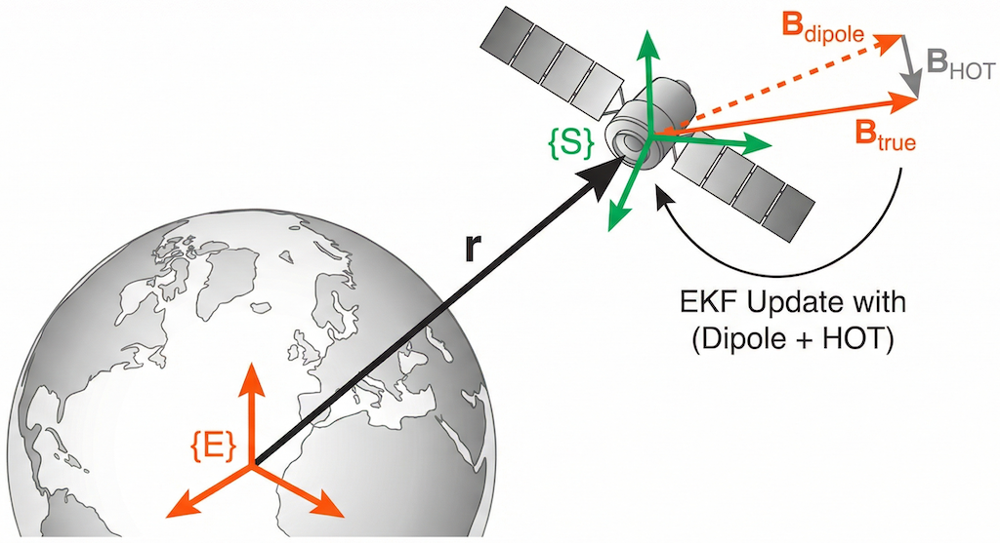
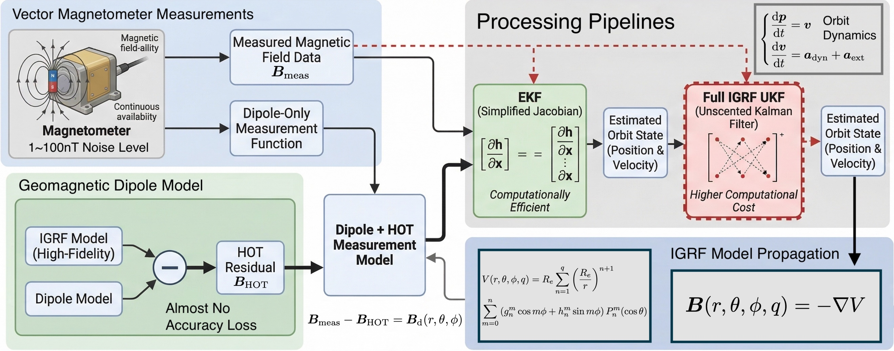
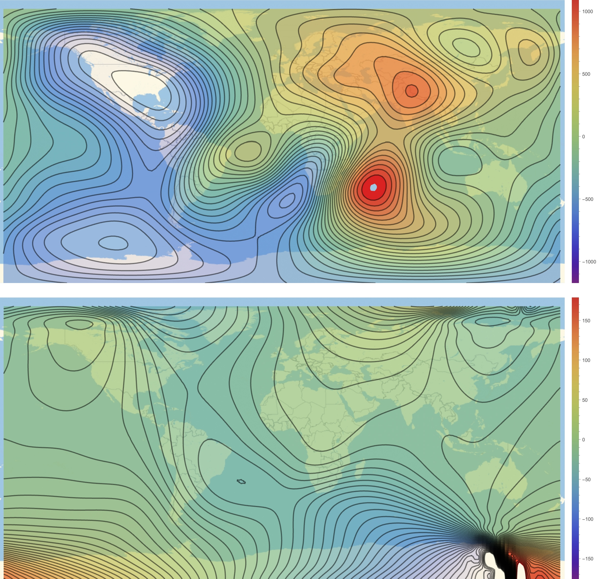
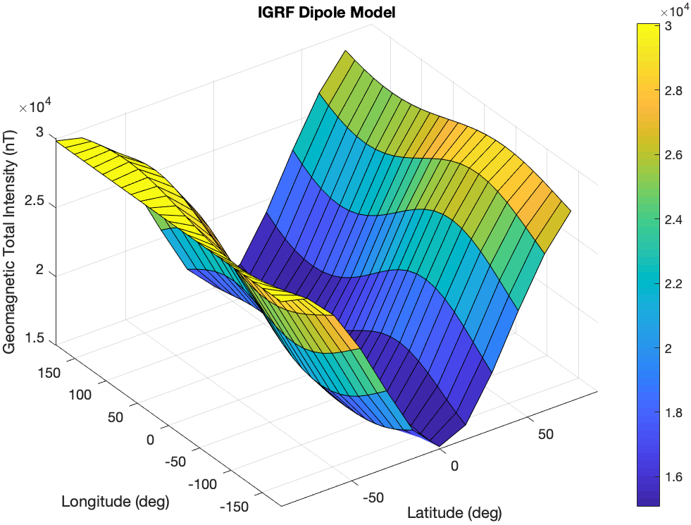
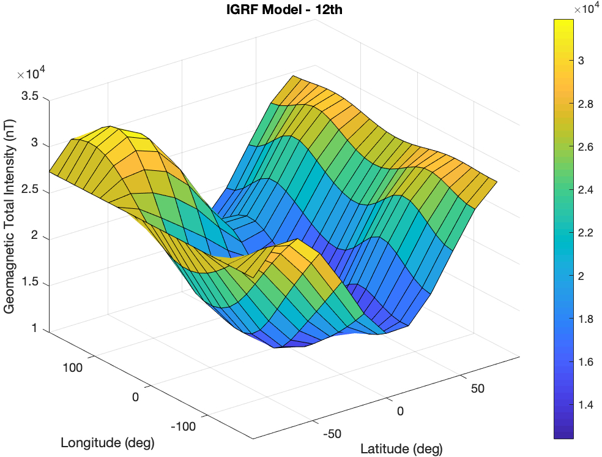
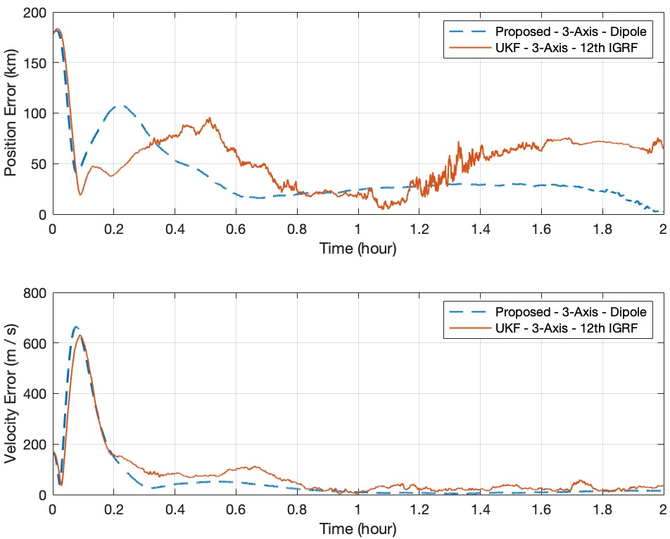
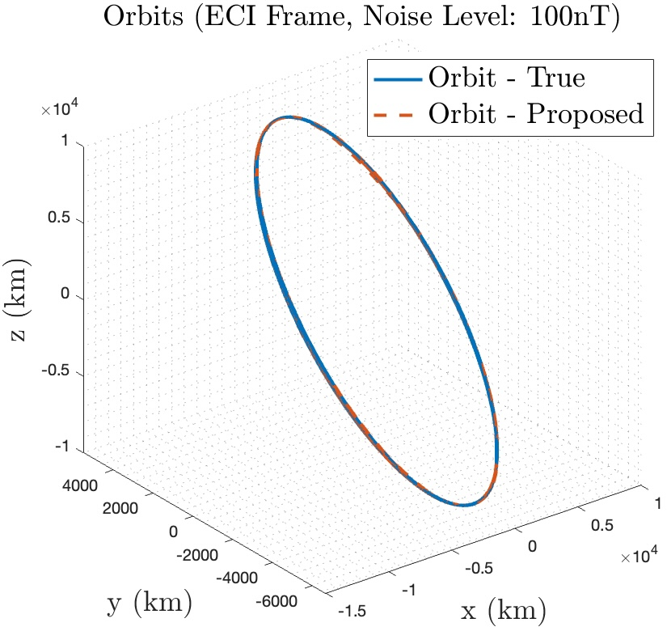

# SV-enabled Geomagnetic Orbit Determination Demo (C++ / CMake / Eigen)

This repository is a **minimal, self-contained demo** of **secular-variation (SV) enabled** geomagnetic orbit determination using a **dipole + high-order-term (HOT)** measurement formulation.

- **Inputs:** AGI STK-exported report files named like `Satellite2*.txt` (e.g., `Satellite2 J2000 Position Velocity.txt`).
- **Outputs:** a CSV log with orbit errors and estimated states.
- **Core idea:** keep the EKF measurement Jacobian **cheap** (dipole only) while keeping measurement fidelity **high** (dipole + HOT residual from a high-order IGRF field).

The README includes the key **figures** and **equations** from the accompanying LaTeX package.

---

## Method at a glance (Dipole + HOT)



At each filter step, we compute a high-order IGRF field at the **predicted** state, subtract the dipole part, and treat that residual as a known correction term (**HOT**).



---

## Why secular variation matters

If you fly long enough, the geomagnetic field **changes** (even if slowly). A fixed-epoch model introduces a time-growing bias.



A prominent component of SV is the **westward drift** of non-dipole features (often summarized as \(\sim 0.2^\circ/\text{yr}\), but spatially/time varying).


The demo implements SV as **multi-modal**, matching the modeling choices described in Section II.C of the paper:

- **none**: no SV correction (fixed coefficients)
- **linear**: linear coefficient update using SV rates
- **drift**: longitude-shift (westward drift) approximation
- **linear_drift**: linear update **+** drift shift

---

## Dipole vs full IGRF (model fidelity vs cost)

The dipole model captures the largest-scale component of the main field, but it misses smaller-scale structure that becomes important for precise geomagnetic orbit determination.

Dipole-only example (degree 1):



Full IGRF example (degree 12):



This demo follows the paper's strategy: compute the **innovation** with a high-order model, but keep the EKF linearization cheap using the dipole Jacobian.

---

## Key equations (as implemented)

### 1) IGRF main field model

The internal geomagnetic potential (spherical harmonics up to degree \(q\)):

$$
V(r,\theta,\lambda,q)=R_e\sum_{n=1}^{q}\left(\frac{R_e}{r}\right)^{n+1}\sum_{m=0}^{n}
\Bigl(g_n^m(t)\cos(m\lambda)+h_n^m(t)\sin(m\lambda)\Bigr)\,P_n^m(\cos\theta).
$$

The magnetic field is

$$
\mathbf{B}(r,\theta,\lambda,q) = -\nabla V.
$$

> **Code mapping:** `IGRFModel::fieldECEF()` evaluates \((B_r,B_\theta,B_\phi)\) in spherical **ECEF** coordinates.

### 2) Dipole model (degree 1)

The dipole-only field (degree \(1\)) used for the EKF Jacobian:

$$
\mathbf{B}_d(r,\theta,\lambda)=\begin{bmatrix}B_{r,d}\\B_{\theta,d}\\B_{\phi,d}\end{bmatrix}
$$

with

$$
\begin{aligned}
B_{r,d} &= 2\left(\frac{R_e}{r}\right)^3\Bigl[(g_1^1\cos\lambda+h_1^1\sin\lambda)\cos\theta + g_1^0\sin\theta\Bigr],\\
B_{\theta,d} &= \left(\frac{R_e}{r}\right)^3\Bigl[-(g_1^1\cos\lambda+h_1^1\sin\lambda)\sin\theta + g_1^0\cos\theta\Bigr],\\
B_{\phi,d} &= \left(\frac{R_e}{r}\right)^3\Bigl(g_1^1\sin\lambda-h_1^1\cos\lambda\Bigr).
\end{aligned}
$$

### 3) Dipole + HOT measurement formulation

We define a predicted high-order correction term

$$
\mathbf{B}_{\text{HOT}}\;\triangleq\;\mathbf{B}(r^-,\theta^-,\lambda^-,q)\; -\; \mathbf{B}_d(r^-,\theta^-,\lambda^-),
$$

and use the dipole-only measurement function:

$$
\underbrace{\mathbf{B}_{\text{meas}} - \mathbf{B}_{\text{HOT}}}_{\text{innovation input}}\;=\;\underbrace{\mathbf{B}_d(r,\theta,\lambda)}_{\text{EKF measurement model}}.
$$

> **Code mapping:** see `main.cpp`:
> - `B_full_pred` = \(\mathbf{B}(\cdot,q)\)
> - `B_dip_pred`  = \(\mathbf{B}_d\)
> - `B_hot_pred`  = `B_full_pred - B_dip_pred`
> - innovation uses `y = B_meas - B_hot_pred` and `h(x)=B_dip_pred`

### 4) SV correction (linear update)

Within an SV validity window around epoch \(t_0\), a standard linear SV update is

$$
\begin{aligned}
g_n^m(t)&=g_n^m(t_0) + (t-t_0)\,\dot g_n^m,\\
h_n^m(t)&=h_n^m(t_0) + (t-t_0)\,\dot h_n^m.
\end{aligned}
$$

> **Code mapping:** `IGRFModel::coeffG()/coeffH()` implement this with `years = days_since_2015 / 365`.

### 5) SV correction (drift as a longitude shift)

A lightweight drift approximation is modeled as a longitude translation:

$$
\lambda(t) \leftarrow \lambda(t) + \dot\lambda_d\,(t-t_0),
$$

where a commonly cited global-mean drift rate is \(\dot\lambda_d\approx -0.2^\circ/\text{yr}\) (east-positive convention; negative is westward drift).

> **Code mapping:** `fieldECEF()` applies `phi = phi0 + drift_rate * years` when `--sv_mode drift|linear_drift`.

---

## Build

### Option A: system Eigen

Install Eigen (e.g., `libeigen3-dev` on Debian/Ubuntu) and build:

```bash
cmake -S . -B build
cmake --build build -j
```

### Option B: FetchContent Eigen (recommended)

If Eigen is not installed, the project can fetch Eigen automatically:

```bash
cmake -S . -B build -DGEOMAG_DEMO_FETCH_EIGEN=ON
cmake --build build -j
```

---

## Run

### Provide STK data path at runtime

```bash
./build/geomag_demo --data_dir /path/to/stk_exports \
  --steps 1200 \
  --sv_mode linear_drift \
  --truth_sv_mode linear_drift \
  --sigma_B 50
```

### Provide STK data path at CMake configure time

```bash
cmake -S . -B build -DSAT_DATA_DIR=/path/to/stk_exports
cmake --build build -j
./build/geomag_demo --steps 1200
```

---

## SV ablation quick check (SV on/off)

To reproduce an **ablation** similar to “with vs. without SV correction”, keep the truth generator fixed and vary the estimator SV mode:

```bash
# Truth has SV, estimator ignores it
./build/geomag_demo --data_dir /path/to/stk_exports \
  --truth_sv_mode linear_drift --sv_mode none

# Truth has SV, estimator matches it
./build/geomag_demo --data_dir /path/to/stk_exports \
  --truth_sv_mode linear_drift --sv_mode linear_drift
```

The program prints RMS errors and (optionally) writes a CSV.

---

## Example results (from the paper)

Initial convergence comparison (dipole+HOT EKF vs full-IGRF UKF):



Example true vs estimated orbit (ECI frame):



---

## Files

- `data/igrfSg2015.txt`, `data/igrfSh2015.txt`: Gauss coefficients and SV rates (epoch 2015).
- `src/igrf.*`: IGRF evaluator with SV modes (`none|linear|drift|linear_drift`).
- `src/stk_loader.*`: STK report parser.
- `src/orbit_propagator.*`: simple 2-body + J2 RK4 propagator.
- `figures/*`: key figures extracted from the LaTeX paper package.
